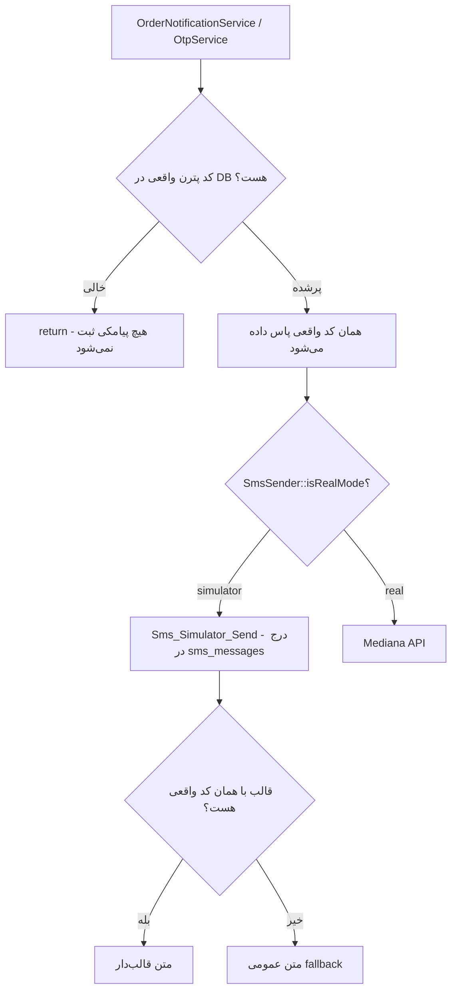
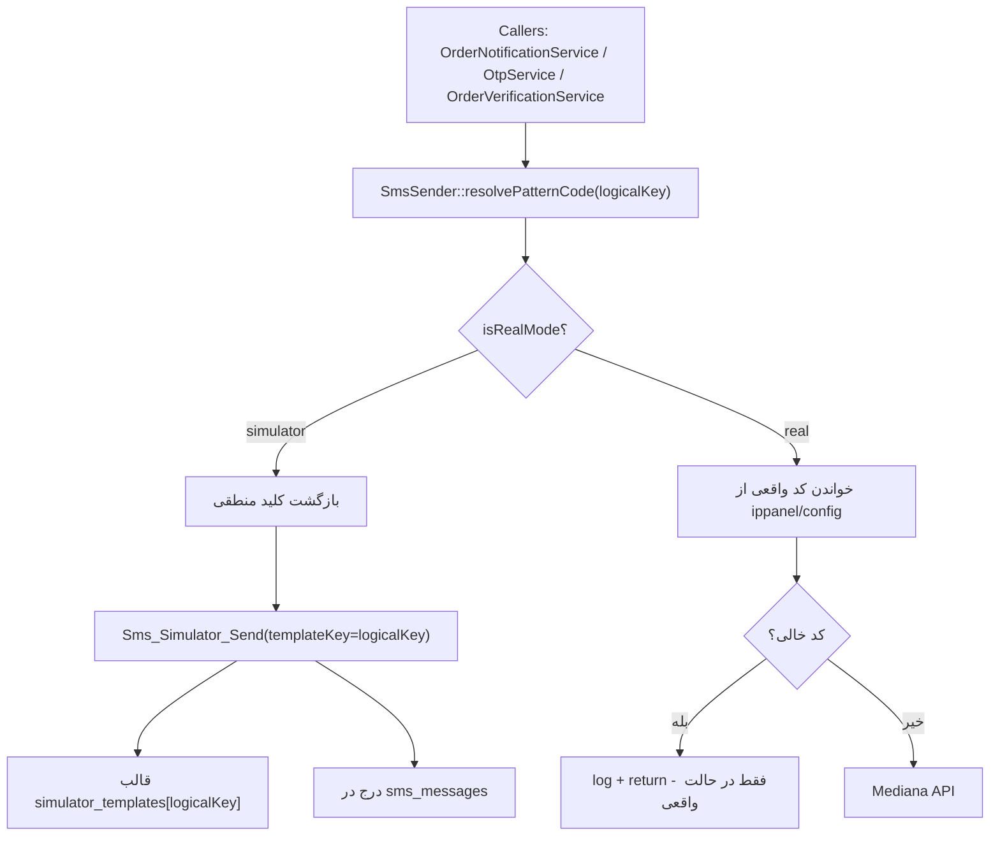

# پلن جداسازی ماژول شبیه‌ساز پیامک از پترن‌های واقعی

## ۱. هدف

در حالت `simulator`، مراحل اطلاع‌رسانی **دقیقاً مثل حالت واقعی** انجام شود (همان نگاشت وضعیت → اطلاع‌رسانی، همان گیرنده‌ها، همان گاردهای `*_is_customer`، همان جریان OTP)، اما:

- **هیچ درخواستی به API مدیانا زده نشود.**
- **هیچ وابستگی‌ای به کدهای پترن واقعی ذخیره‌شده در دیتابیس نباشد.**
- فقط یک رکورد در جدول `sms_messages` درج شود تا در ماژول «شبیه‌ساز پیامک» قابل مانیتور باشد.

در حالت `real`، رفتار فعلی بدون تغییر باقی بماند.

---

## ۲. وضعیت فعلی و مشکل

سوئیچ حالت در [`SmsSender::sendPattern()`](app/Helpers/SmsSender.php:63) و [`SmsSender::sendOtp()`](app/Helpers/SmsSender.php:98) انجام می‌شود و در حالت شبیه‌ساز به [`Sms_Simulator_Send()`](app/Helpers/SmsSimulator.php:16) می‌رود (درج در DB). این بخش درست است.

اما دو وابستگی به پترن واقعی باقی مانده است:

1. **گارد پیش از رسیدن به `SmsSender`:** لایه‌های فراخوان کد پترن را از DB می‌خوانند و اگر خالی باشد زودتر `return` می‌کنند:
   - [`OrderNotificationService::getPatternCode()`](app/Services/Order/OrderNotificationService.php:53) و گاردهای `if (! $patternCode)`
   - [`OrderVerificationService::sendVerificationSms()`](app/Services/Order/OrderVerificationService.php:174)
   - [`OtpService::issue()`](app/Services/Auth/OtpService.php:43)
   ⇒ در حالت شبیه‌ساز، اگر پترن واقعی تنظیم نشده باشد، **پیامک هرگز ثبت نمی‌شود**.

2. **متن پیام با کد واقعی کلید می‌خورد:** [`getPattern()`](app/Helpers/SmsSimulator.php:36) از `config("mediana.simulator_templates.{$patternCode}")` استفاده می‌کند؛ پس اگر کد واقعی عوض شود، قالب پیدا نمی‌شود و متن عمومی fallback نمایش داده می‌شود.



---

## ۳. طراحی پیشنهادی

ایده اصلی: **کلید منطقی** (Logical Key) به‌جای کد پترن واقعی در حالت شبیه‌ساز.

- هر اطلاع‌رسانی یک کلید منطقی ثابت دارد (مثلاً `pattern_order_searching`، `otp_pattern_code`).
- رزولور مرکزی روی `SmsSender` تصمیم می‌گیرد:
  - حالت شبیه‌ساز → همان کلید منطقی برگردانده می‌شود (هرگز خالی نیست ⇒ گارد رد نمی‌شود).
  - حالت واقعی → کد پترن واقعی از `ipspanel.*` / `config('mediana.*')` خوانده می‌شود (اگر خالی بود `null`).
- `simulator_templates` بر اساس **کلیدهای منطقی** بازنویسی می‌شود (نه کدهای تصادفی).
- `sms_messages.pattern_code` در حالت شبیه‌ساز همان کلید منطقی را نگه می‌دارد (معنادارتر برای مانیتور).



### ۳.۱. کلیدهای منطقی و نگاشت آن‌ها

| کلید منطقی (simulator template) | کلید تنظیم Pترن واقعی | کلید پارامتر واقعی | گیرنده |
|---|---|---|---|
| `otp_pattern_code` | `ippanel.otp_pattern_code` | — (اندپوینت اختصاصی) | موبایل کاربر |
| `verification_link_pattern_code` | `ippanel.verification_link_pattern_code` | `verification_link_param_key` | فرستنده/گیرنده غیرمشتری |
| `pattern_order_searching` | `ippanel.pattern_order_searching` | `order_status_param_key` | مشتری |
| `pattern_courier_not_found` | `ippanel.pattern_courier_not_found` | `order_status_param_key` | مشتری |
| `pattern_order_courier_assigned` | `ippanel.pattern_order_courier_assigned` | `order_status_param_key` | مشتری |
| `pattern_order_waiting_pickup` | `ippanel.pattern_order_waiting_pickup` | `order_status_param_key` | مشتری |
| `pattern_order_picked_up` | `ippanel.pattern_order_picked_up` | `order_status_param_key` | مشتری |
| `pattern_order_in_transit` | `ippanel.pattern_order_in_transit` | `order_status_param_key` | مشتری |
| `pattern_order_delivered` | `ippanel.pattern_order_delivered` | `order_status_param_key` | مشتری |
| `pattern_order_cancelled` | `ippanel.pattern_order_cancelled` | `order_status_param_key` | مشتری |
| `pattern_sender_order_waiting_pickup` | `ippanel.pattern_sender_order_waiting_pickup` | `non_customer_status_param_key` | فرستنده/گیرنده |
| `pattern_sender_order_picked_up` | `ippanel.pattern_sender_order_picked_up` | `non_customer_status_param_key` | فرستنده/گیرنده |
| `pattern_sender_order_in_transit` | `ippanel.pattern_sender_order_in_transit` | `non_customer_status_param_key` | فرستنده/گیرنده |
| `pattern_sender_order_delivered` | `ippanel.pattern_sender_order_delivered` | `non_customer_status_param_key` | فرستنده/گیرنده |
| `pattern_sender_order_cancelled` | `ippanel.pattern_sender_order_cancelled` | `non_customer_status_param_key` | فرستنده/گیرنده |
| `pattern_courier_offer` | `ippanel.pattern_courier_offer` | `courier_offer_param_key` | پیک |
| `pattern_courier_cancelled` | `ippanel.pattern_courier_cancelled` | `courier_cancelled_param_key` | پیک |
| `pattern_system_cancellation` | `ippanel.pattern_system_cancellation` | `system_cancellation_param_key` | مشتری |
| `pattern_survey_link` | `ippanel.pattern_survey_link` | `survey_link_param_key` | فرستنده/گیرنده |
| `pattern_cash_on_delivery` | `ippanel.pattern_cash_on_delivery` | `cash_on_delivery_param_key` | گیرنده/فرستنده |

### ۳.۲. جدول رفتار

| موضوع | حالت شبیه‌ساز | حالت واقعی |
|---|---|---|
| خواندن کد پترن از DB لازم است؟ | خیر | بله |
| مقدار پاس‌داده‌شده به سرویس ارسال | کلید منطقی | کد واقعی مدیانا |
| گارد `if (! $patternCode) return` | هرگز فعال نمی‌شود | مثل قبل |
| تماس با API مدیانا | خیر | بله |
| قالب متن | `simulator_templates[logicalKey]` | روی سرویس مدیانا |
| مقدار `sms_messages.pattern_code` | کلید منطقی | — (اصلاً درج نمی‌شود) |

---

## ۴. تغییرات دقیق فایل‌ها

### ۴.۱. [`app/Helpers/SmsSender.php`](app/Helpers/SmsSender.php)
- افزودن متد عمومی:
  ```php
  /**
   * رزولور کد پترن بر اساس کلید منطقی.
   * در حالت شبیه‌ساز، خودِ کلید منطقی برگردانده می‌شود تا شبیه‌ساز به پترن واقعی وابسته نباشد.
   */
  public function resolvePatternCode(string $logicalKey): ?string
  {
      if (! $this->isRealMode()) {
          return $logicalKey;
      }

      $value = Setting::getValue("ippanel.{$logicalKey}", config("mediana.{$logicalKey}"));

      return is_scalar($value) && $value !== '' ? (string) $value : null;
  }
  ```
- بدون تغییر در امضای `send()`، `sendPattern()` و `sendOtp()`.

### ۴.۲. [`app/Services/Order/OrderNotificationService.php`](app/Services/Order/OrderNotificationService.php)
- حذف متد خصوصی `getPatternCode()` و جایگزینی همه فراخوانی‌ها با `$this->smsSender->resolvePatternCode($patternKey)`.
- گاردهای `if (! $patternCode)` حفظ می‌شوند (فقط در حالت واقعی فعال می‌شوند).
- `getParamKey()` بدون تغییر می‌ماند (فقط در حالت واقعی معنا دارد).
- گاردهای `sender_is_customer`/`receiver_is_customer` بدون تغییر (مطابق حالت واقعی).

### ۴.۳. [`app/Services/Order/OrderVerificationService.php`](app/Services/Order/OrderVerificationService.php)
- در `sendVerificationSms()`: جایگزینی خواندن مستقیم `Setting::getValue('ippanel.verification_link_pattern_code', ...)` با `$this->smsSender->resolvePatternCode('verification_link_pattern_code')`.
- گارد `if (! $patternCode)` حفظ می‌شود.
- خواندن `verification_link_param_key` بدون تغییر.

### ۴.۴. [`app/Services/Auth/OtpService.php`](app/Services/Auth/OtpService.php)
- جایگزینی `patternCode: (string) Setting::getValue('ippanel.otp_pattern_code', config(...))` با:
  ```php
  $patternCode = $this->smsSender->resolvePatternCode('otp_pattern_code');

  if (! $patternCode) {
      Log::info('sms.pattern_not_configured', ['key' => 'otp_pattern_code']);

      return; // فقط در حالت واقعی رخ می‌دهد
  }
  ```
- در حالت شبیه‌ساز همیشه مقدار دارد ⇒ OTP همیشه ثبت می‌شود.

### ۴.۵. [`app/Helpers/SmsSimulator.php`](app/Helpers/SmsSimulator.php)
- تغییر نام پارامترهای `getPattern()` و `Sms_Simulator_Send()` از `patternCode` به `templateKey` (فقط نام‌گذاری و مستندات؛ منطق کد تغییری نمی‌کند).
- به‌روزرسانی کامنت‌ها: توضیح اینکه کلید ورودی در حالت شبیه‌ساز «کلید منطقی» است.

### ۴.۶. [`config/mediana.php`](config/mediana.php)
- بازنویسی `simulator_templates` با **کلیدهای منطقی** به‌جای کدهای تصادفی. مثال:
  ```php
  'simulator_templates' => [
      'otp_pattern_code' => 'کد تایید شما :value می‌باشد',
      'verification_link_pattern_code' => 'لینک تایید سفارش: :value',
      'pattern_order_searching' => 'در حال جستجوی پیک برای سفارش :value هستیم',
      'pattern_courier_not_found' => 'برای سفارش :value پیکی یافت نشد؛ می‌توانید جستجو را مجدداً آغاز کنید یا سفارش را لغو کنید',
      'pattern_order_courier_assigned' => 'پیک برای سفارش :value تعیین شد',
      // ... بقیه وضعیت‌ها با همان کلیدهای منطقی جدول بخش ۳.۱
  ],
  ```
- به‌روزرسانی کامنت بالای `simulator_templates` (کلید = کلید منطقی، نه کد پترن مدیانا).

### ۴.۷. [`.env`](.env) و [`.env.example`](.env.example)
- کدهای `MEDIANA_PATTERN_*` در حالت واقعی مصرف می‌شوند؛ در حالت شبیه‌ساز دیگر استفاده نمی‌شوند.
- مقدار موقت `MEDIANA_PATTERN_COURIER_NOT_FOUND=m3n8b5v2c7q1` (که فقط برای شبیه‌ساز اضافه شده بود) باید خالی شود، چون در حالت واقعی یک کد نامعتبر است. (تصمیم در بخش ۶)

---

## ۵. تأثیر و ریسک

- **بدون مایگریشن جدید:** ساختار `sms_messages` تغییری نمی‌خواهد.
- **سازگاری عقب‌رو:** در حالت واقعی رفتار کاملاً ثابت می‌ماند؛ فقط مسیر حالت شبیه‌ساز جدا می‌شود.
- **کلیدهای قدیمی `simulator_templates`:** حذف می‌شوند (جایی جز `getPattern` استفاده نمی‌شدند).
- **تست‌های موجود:** [`SmsSettingsComponentTest`](tests/Unit/Sms/SmsSettingsComponentTest.php) و [`MedianaSmsServiceTest`](tests/Unit/Sms/MedianaSmsServiceTest.php) به این مسیر وابسته نیستند و نباید بشکنند.

---

## ۶. تصمیم‌های نیازمند تأیید

1. **جای رزولور:** متد روی `SmsSender` (پیشنهاد، حداقل تغییر) یا کلاس مستقل `SmsPatternResolver`؟
2. **مقدار `MEDIANA_PATTERN_COURIER_NOT_FOUND`:** خالی شود (پیشنهاد، چون کد واقعی ندارید) یا به‌عنوان کد موقت باقی بماند؟
3. **نام ستون `sms_messages.pattern_code`:** حفظ شود (پیشنهاد) یا به `template_key` تغییر کند (نیازمند مایگریشن)؟

---

## ۷. معیارهای پذیرش

- در حالت شبیه‌ساز و با **خالی بودن همه پترن‌های واقعی**، برای هر رویداد (OTP، لینک تایید، تغییر وضعیت مشتری/غیرمشتری، پیک، نظرسنجی، پرداخت نقدی) یک رکورد در `sms_messages` درج شود.
- متن رکوردها از `simulator_templates` با کلید منطقی ساخته شود (بدون fallback عمومی).
- در حالت واقعی، همه گاردهای «پترن تنظیم نشده» مثل قبل عمل کنند و درخواست به مدیانا بدون تغییر بماند.
- اجرای `php vendor/bin/pint --dirty --format agent` و تست‌های موجود سبز باشند.
